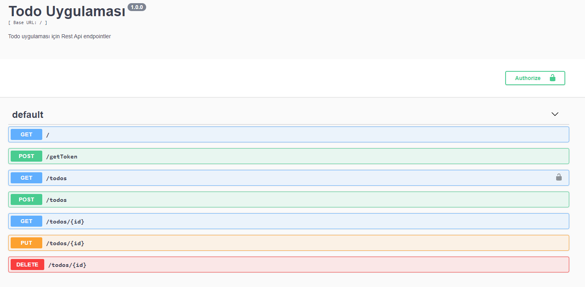
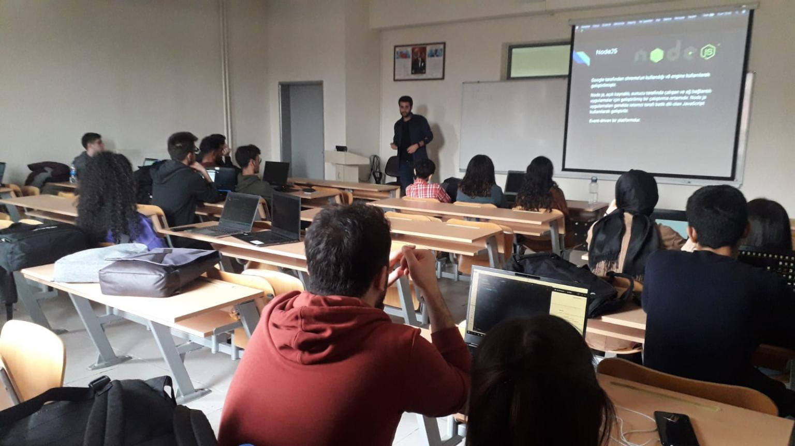

# NodeJs Todo Api
[](https://nodejs.org/)
[](https://www.express.com/)
[](LICENSE.md)
Celal Bayar Üniversitesi Hasan Ferdi Turgutlu Teknoloji Fakültesi Sosyal Sorumluluk projesi olarak hazırladığım
Nodejs Restful API eğitimi için örnek bir proje

### Todo Rest API: https://nodejs-restapi-example.herokuapp.com/

### Dokümantasyon: 
https://nodejs-restapi-example.herokuapp.com/api-docs/

### Sunum : 
https://docs.google.com/presentation/d/1g0gyH2sG1JP8P5Ce4jN4-exTvQrnpWoXlCZ8KMqm2sQ/edit?usp=sharing


Projeyi çalıştırmak için;
```
  cd NodeJs-Api-Sample
  
  npm install
  
  npm start
```
